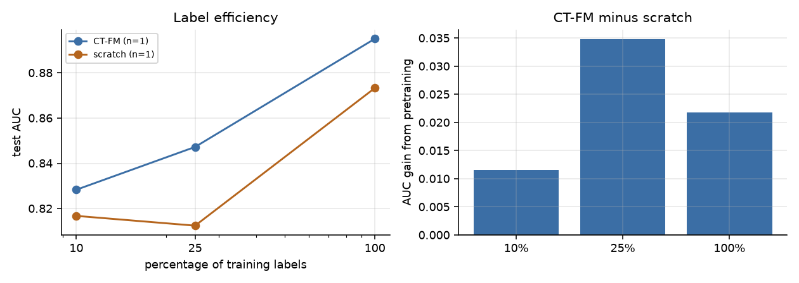
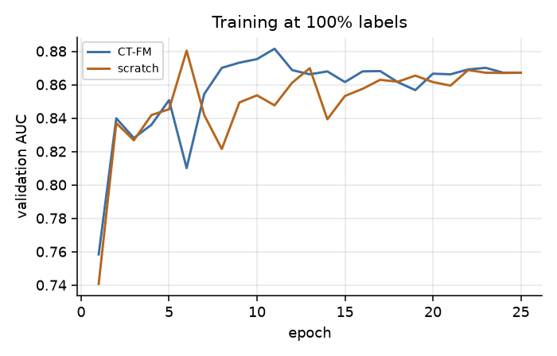
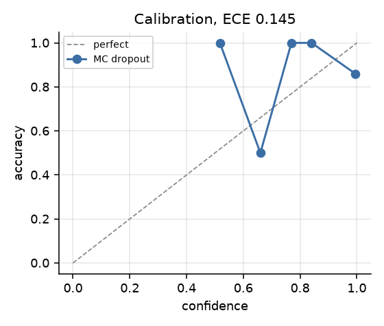
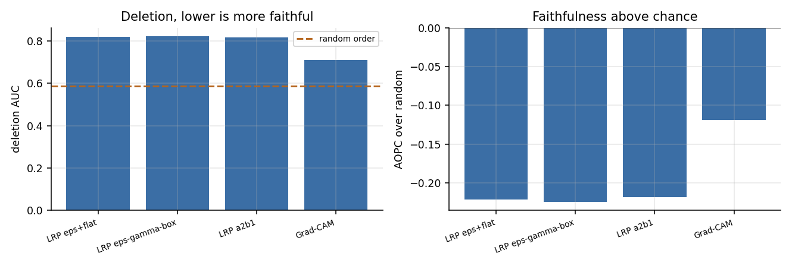
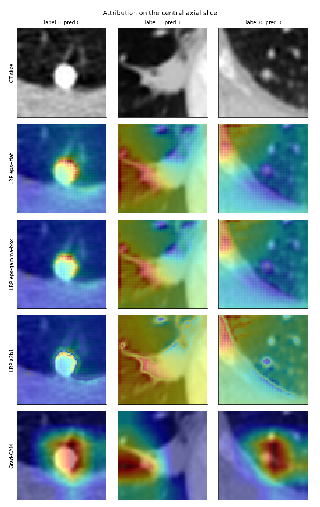
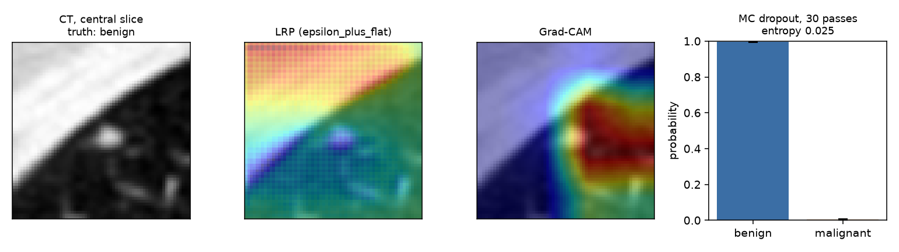
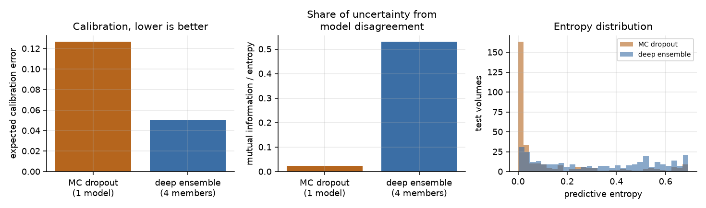
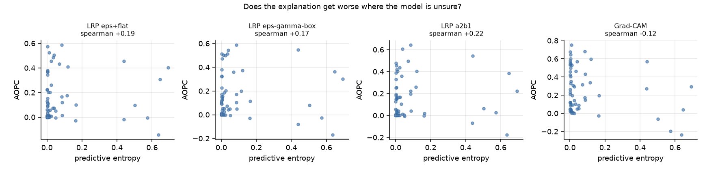

# CT Foundation Model, Layer-wise Relevance Propagation and Uncertainty

Fine-tuning CT-FM, a self-supervised CT foundation model, for lung-nodule
malignancy classification, with layer-wise relevance propagation attribution,
faithfulness evaluation and uncertainty estimation.

---

## 1. Goal

Three questions:

1. Does self-supervised CT pretraining improve downstream performance compared
   with the same architecture trained from random initialisation, and is the
   effect larger than the variation between training seeds?
2. Do the resulting attribution maps pass a faithfulness test, measured by
   deletion, insertion and AOPC against a random-order baseline?
3. Does attribution faithfulness vary with predictive uncertainty?

---

## 2. Data and model

### 2.1 NoduleMNIST3D

| Property | Value |
|---|---|
| Source | [MedMNIST v2](https://medmnist.com/), derived from LIDC-IDRI, CC BY 4.0 |
| Content | 3D chest CT patches centred on lung nodules |
| Resolution | 64 x 64 x 64 |
| Task | benign against malignant |
| Train / val / test | 1,158 / 165 / 310 |
| Train class balance | 863 benign, 295 malignant |

The classes are imbalanced approximately 3:1. Loss is class-weighted, balanced
accuracy and AUC are reported alongside accuracy, and model selection uses
validation AUC.

The 64^3 release is used because CT-FM downsamples by a factor of 16 and a 28^3
volume is not divisible by the network stride.

### 2.2 CT-FM

| Property | Value |
|---|---|
| Checkpoint | [`project-lighter/ct_fm_feature_extractor`](https://huggingface.co/project-lighter/ct_fm_feature_extractor) |
| Architecture | SegResNet, 87.2M parameters |
| Pretraining | contrastive self-supervised learning on 148,000 CT scans from the Imaging Data Commons |
| Reference | [arXiv:2501.09001](https://arxiv.org/abs/2501.09001) |

The encoder returns a five-level feature pyramid. This implementation uses the
bottleneck at 512 channels and 4^3 resolution, followed by global average
pooling, LayerNorm and a linear head.

### 2.3 Implementation notes

Three issues affect correctness and produce no error message.

**Checkpoint loading.** The published checkpoint does not load into MONAI's
`SegResNetDS`. Parameter names differ and `load_state_dict(strict=False)`
matches 0 of 161 tensors without raising, leaving the network randomly
initialised. Use the `lighter_zoo` loader.

**From-scratch control.** Constructing a separate SegResNet from an inferred
configuration produced 19.9M parameters against the true 87.2M. The control arm
in this repository is the loaded model with every parameter reinitialised, which
keeps both arms architecturally identical.

**Feature extraction.** Pooling the full SegResNet output gives the linear head
two features, since the output is a 2-channel volume. With unnormalised features
(standard deviation approximately 0.03) training loss remained at 6.37 with AUC
0.50. Using the bottleneck with LayerNorm gives 0.51 and 0.78.

---

## 3. Method

### 3.1 Label-efficiency ablation

Each configuration is trained twice, from CT-FM weights and from random
initialisation, at 10%, 25% and 100% of the training labels. Subsets are
stratified and drawn with a fixed seed so both arms use identical volumes. The
encoder is fine-tuned at 1e-5 and the head at 1e-3.

### 3.2 Attribution

Four methods. Three LRP composites from
[zennit](https://github.com/chr5tphr/zennit), whose layer-type registry covers
`Conv3d` and the 3D pooling operators, plus Grad-CAM.

| Method | Rule |
|---|---|
| `EpsilonPlusFlat` | positive contributions in the convolutional stack, flat rule at the input |
| `EpsilonGammaBox` | gamma rule, box rule at the input for bounded inputs |
| `EpsilonAlpha2Beta1` | positive and negative contributions at a 2:1 ratio |
| Grad-CAM | gradient-weighted bottleneck activations, trilinearly upsampled |

### 3.3 Faithfulness

**Deletion** replaces the highest-ranked voxels with the dataset mean in
increments and records the target-class probability. Lower area under the curve
indicates a faster collapse and a more faithful map.

**Insertion** restores the highest-ranked voxels onto a blurred volume.

**AOPC** is the mean probability drop across deletion steps.

Each map is accompanied by a random-order baseline, since absolute values depend
on the model and data.

**Stability** is the mean correlation between the map on a clean input and on a
noisy copy (sigma = 0.05).

### 3.4 Uncertainty

MC dropout over 20 passes gives predictive entropy and mutual information.
Expected calibration error is computed over 10 equal-width confidence bins.

---

## 4. Results

### 4.1 Label-efficiency ablation



Three paired seeds were run at each label budget. Both arms within a seed use
identical data subsets. Per-seed test AUC:

| Labels | Seed | CT-FM | Scratch | Gain |
|---|---|---|---|---|
| 10% | 0 | 0.8283 | 0.8168 | +0.0116 |
| 10% | 1 | 0.8042 | 0.8053 | -0.0011 |
| 10% | 2 | 0.7936 | 0.7548 | +0.0388 |
| 25% | 0 | 0.8472 | 0.8124 | +0.0348 |
| 25% | 1 | 0.8747 | 0.8707 | +0.0040 |
| 25% | 2 | 0.8552 | 0.8533 | +0.0018 |
| 100% | 0 | 0.8951 | 0.8733 | +0.0218 |
| 100% | 1 | 0.9111 | 0.9100 | +0.0011 |
| 100% | 2 | 0.8805 | 0.8860 | -0.0055 |

Summary over the three seeds:

| Labels | CT-FM mean | Scratch mean | Mean gain | Gain range | CT-FM wins |
|---|---|---|---|---|---|
| 10% | 0.8087 | 0.7923 | +0.0164 | [-0.0011, +0.0388] | 2 of 3 |
| 25% | 0.8591 | 0.8455 | +0.0136 | [+0.0018, +0.0348] | 3 of 3 |
| 100% | 0.8955 | 0.8898 | +0.0058 | [-0.0055, +0.0218] | 2 of 3 |

The mean gain from pretraining is positive at all three budgets. It is smaller
than the spread between seeds at 10% and 100%, where one seed in each case
favoured the randomly-initialised arm. Only the 25% budget shows CT-FM ahead in
every seed, and there the mean gain is +0.0136.

The largest single-seed gain at full labels (+0.0218, seed 0) is roughly four
times the three-seed mean (+0.0058). Any single run of this experiment can
therefore overstate or understate the effect by a wide margin.

With three seeds the data supports a small positive effect of pretraining on
this task and does not support a specific effect size. Distinguishing +0.006
from zero at 100% labels would need substantially more replicates.



### 4.2 Calibration



Expected calibration error 0.145 under MC dropout, with mean predictive entropy
0.085.

### 4.3 Faithfulness



Evaluated on 64 test volumes.

| Method | Deletion AUC | Insertion AUC | AOPC | AOPC over random | Stability |
|---|---|---|---|---|---|
| Random baseline | 0.587 | | 0.368 | | |
| LRP eps+flat | 0.819 | 0.972 | 0.147 | -0.221 | 0.012 |
| LRP eps-gamma-box | 0.822 | 0.972 | 0.144 | -0.224 | -0.015 |
| LRP alpha2-beta1 | 0.816 | 0.973 | 0.149 | -0.219 | 0.220 |
| Grad-CAM | 0.712 | 0.974 | 0.249 | -0.119 | 0.924 |

A faithful map should give a lower deletion AUC than the random baseline. All
four methods give higher values, so deleting the voxels they rank highest
reduces the prediction less than deleting random voxels.

The likely cause is the baseline. Random deletion distributes replaced voxels
uniformly through the volume; at 5% this produces a volume unlike any CT scan,
and the network's output collapses because the input is far from the training
distribution. Attribution-guided deletion removes a compact contiguous region,
which remains closer to a plausible scan. Under this protocol the random
baseline benefits from distribution shift.

Two consequences:

- Deletion with mean-value masking does not discriminate between attribution
  methods on this task. A manifold-preserving masking scheme, such as inpainting
  the removed region, is required before the protocol can be used for ranking.
- Insertion does not separate the methods either: all four reach 0.972 to 0.974.

**Stability** does separate them. Grad-CAM maps are nearly invariant under input
noise (0.924), while the LRP composites give 0.012, -0.015 and 0.220. Grad-CAM
is computed at 4^3 and upsampled, which limits how much it can change. LRP
resolves to input resolution and is correspondingly more sensitive.



### 4.4 Single-volume inference

`src/infer.py` reports prediction, uncertainty and attribution for one volume.



```
volume 3: truth benign, predicted benign at p=0.997
  predictive entropy 0.0252, mutual information 0.0005
  spread over 30 dropout passes: 0.0022
```

Mutual information near zero with low total entropy indicates agreement between
dropout samples. The residual uncertainty is therefore attributable to ambiguity
in the data.

### 4.5 Deep ensemble against MC dropout

Each full-label run saves a tagged checkpoint, so the seed replicates that
produce the error bands in Section 4.1 also serve as ensemble members. Four
independently trained models were available.



| Estimator | AUC | ECE | Mean entropy | Mean MI | MI share of entropy |
|---|---|---|---|---|---|
| Best single member | 0.9111 | | | | |
| MC dropout, one model, 20 passes | 0.8960 | 0.1265 | 0.1254 | 0.0030 | 0.024 |
| Deep ensemble, 4 members | 0.9085 | 0.0505 | 0.3256 | 0.1724 | 0.530 |

Per-member test AUC: 0.8951, 0.9093, 0.9111, 0.8805.

The ensemble reduces expected calibration error from 0.1265 to 0.0505 at
comparable AUC. The two estimators also differ in what they attribute the
uncertainty to. Under MC dropout, mutual information accounts for 2.4% of
predictive entropy, so almost all of the reported uncertainty is assigned to
ambiguity in the data. Under the ensemble it accounts for 53.0%, indicating
substantial disagreement between independently trained models that dropout
sampling on a single set of weights does not expose.

### 4.6 Uncertainty against faithfulness



Spearman correlation between predictive entropy and per-sample AOPC:

| Method | rho |
|---|---|
| LRP eps+flat | +0.190 |
| LRP eps-gamma-box | +0.174 |
| LRP alpha2-beta1 | +0.221 |
| Grad-CAM | -0.124 |

The three LRP composites agree with each other and give weakly positive
correlations. Grad-CAM gives a weakly negative one. With 64 volumes none of
these correlations is statistically significant.

---

## 5. Reproducing

### Requirements

```
torch  monai  medmnist  zennit  lighter-zoo  numpy  scipy  matplotlib
```

One GPU. The ablation takes about 14 minutes on an A100.

On Volta hardware such as the V100, pin `torch==2.5.1+cu121`. Releases from 2.14
ship an architecture list beginning at `sm_75`, and CUDA calls fail with
`no kernel image is available for execution on the device`.

### Pipeline

```bash
# 1. Ablation, both arms at three label budgets (14 min on an A100)
PYTHONPATH=src python src/train.py --epochs 25 --batch-size 16 \
    --fractions 0.1 0.25 1.0

# 2. Seed replicates
PYTHONPATH=src python src/train.py --epochs 25 --seed 1 --tag _seed1 \
    --fractions 0.1 0.25 1.0

# 3. Attribution, faithfulness and uncertainty
PYTHONPATH=src python src/analyse.py --n 64 --batch 4

# 4. Deep-ensemble uncertainty, using the tagged checkpoints from step 2
PYTHONPATH=src python src/ensemble.py

# 5. Single-volume inference
PYTHONPATH=src python src/infer.py --index 3

# 6. Figures
PYTHONPATH=src python src/figures.py
```

---

## 6. Repository layout

```
src/data.py           NoduleMNIST3D loaders with stratified subsetting
src/model.py          CT-FM encoder with a classification head
src/train.py          fine-tuning and the label-efficiency ablation
src/explain.py        zennit LRP composites and Grad-CAM
src/faithfulness.py   deletion, insertion, AOPC and stability
src/uncertainty.py    MC dropout, ensembles, calibration
src/analyse.py        attribution and uncertainty analysis
src/ensemble.py       deep-ensemble uncertainty
src/infer.py          single-volume inference
src/figures.py        figure generation
results/              metrics as JSON, per-sample arrays as npz
docs/figures/         figures
paper/                IEEE-format technical report
```

---

## 7. Limitations

**Seeds.** Three paired seeds per budget. The mean gain is smaller than the
between-seed spread at 10% and 100% of labels, so the effect size is not
resolved. Section 4.1 reports per-seed values so the variance is visible.

**Sample size.** The attribution analysis covers 64 volumes. This is sufficient
to show that the deletion metric fails to discriminate between methods. Resolving
the weak correlation between uncertainty and faithfulness would require a larger
sample.

**Deletion baseline.** Voxels are replaced with the dataset mean. A blurred or
inpainted baseline would stay nearer the data distribution and may change the
conclusion in Section 4.3.

**Resolution.** Inputs are 64^3 patches. CT-FM was pretrained on whole scans, so
the representation may not be used as intended at this scale.

**Ensemble size.** The deep ensemble in Section 4.5 has four members, which is
at the low end for stable uncertainty estimates. All members share the same
pretrained initialisation, so their diversity arises only from data ordering,
subsampling and dropout.

---

## 8. References

- Pai et al., *Vision Foundation Models for Computed Tomography*,
  [arXiv:2501.09001](https://arxiv.org/abs/2501.09001)
- Bach et al., *On Pixel-Wise Explanations for Non-Linear Classifier Decisions
  by Layer-Wise Relevance Propagation*, PLoS ONE 10(7), 2015
- Anders et al., *Software for Dataset-wide XAI* (zennit),
  [arXiv:2106.13200](https://arxiv.org/abs/2106.13200)
- Selvaraju et al., *Grad-CAM*, ICCV 2017
- Samek et al., *Evaluating the Visualization of What a Deep Neural Network Has
  Learned*, IEEE TNNLS 28(11), 2017
- Salahuddin et al., *Transparency of deep neural networks for medical image
  analysis: a review of interpretability methods*, Computers in Biology and
  Medicine 140, 2022
- Gal and Ghahramani, *Dropout as a Bayesian Approximation*, ICML 2016
- Yang et al., *MedMNIST v2*, Scientific Data 10, 2023
- Armato et al., *The Lung Image Database Consortium (LIDC) and Image Database
  Resource Initiative (IDRI)*, Medical Physics 38(2), 2011
