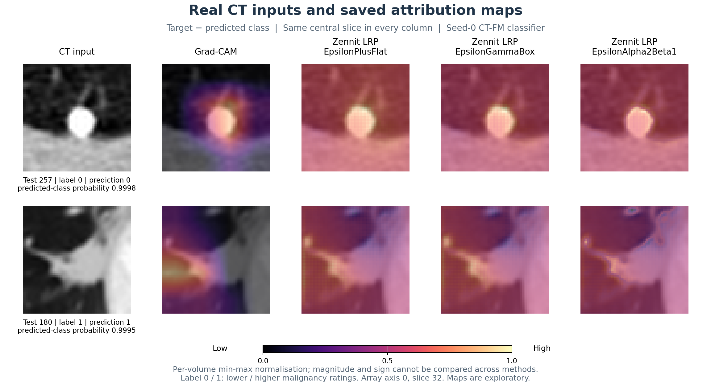
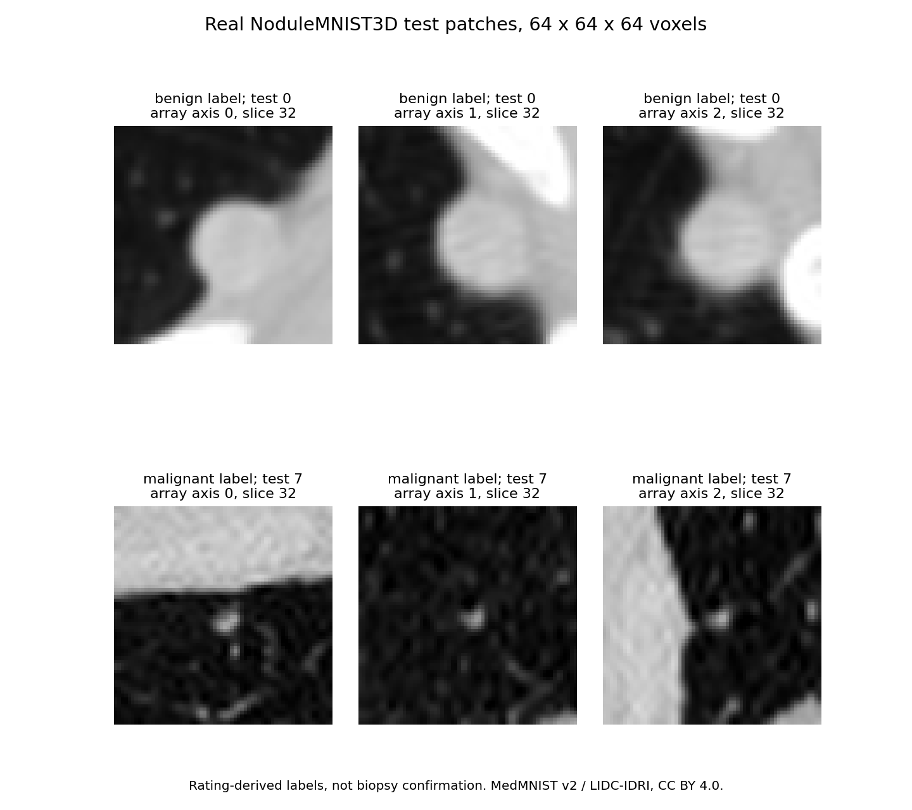
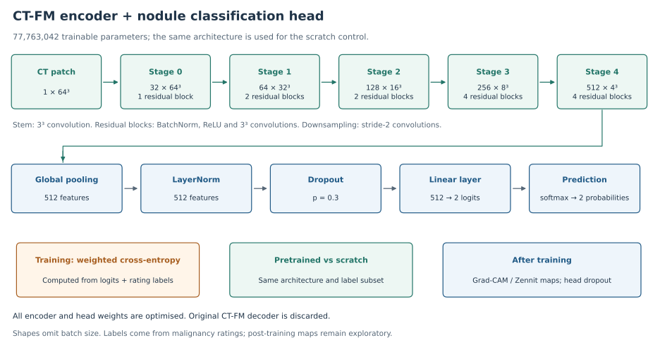
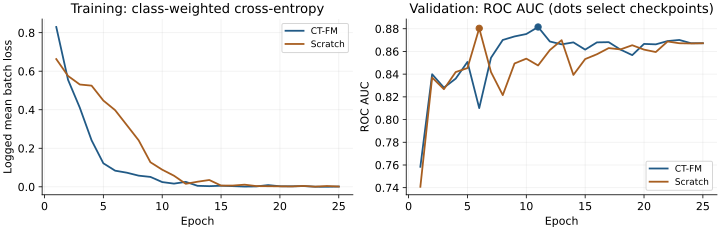

# CT Foundation Models, Attribution and Uncertainty

Does a pretrained CT encoder help with limited labels, and what can its attribution maps tell us? This project fine-tunes **CT-FM on 3D lung-nodule patches**, compares it with the same architecture trained from scratch, and examines attribution and uncertainty.

**Main finding:** pretraining gives small average AUC gains in the available matched runs, with seed variation. The current attribution experiments do not establish faithful or clinically validated explanations.

[📊 Results](docs/results.md) · [▶ Run it](docs/reproduce.md) · [🔍 Verification](docs/verification.md) · [Technical report](paper/ctfm_lrp_uncertainty.pdf)

## Attribution maps: Grad-CAM and Zennit LRP



**Read left to right:** the CT input, Grad-CAM, EpsilonPlusFlat, EpsilonGammaBox and EpsilonAlpha2Beta1. These are saved model outputs for test cases **257 and 180**, the first two cases of the original analysis subset. All columns show the same slice and explain the predicted class. Label 0 means lower malignancy ratings; label 1 means higher ratings.

**Colours:** brighter colours indicate higher values within each normalised map. Each method/volume was scaled separately, so colour intensity cannot compare absolute importance across methods or distinguish positive from negative evidence. These exploratory maps are not segmentation masks or validated clinical explanations.

[Four-case gallery and how to interpret the maps](docs/attribution.md) · [Saved arrays](results/qualitative.npz) · [Verified example identities](results/attribution_examples.json)

## What does the data look like?



These are **real NoduleMNIST3D test patches**, indices 0 and 7. The labels come from radiologist malignancy ratings, **not biopsy-confirmed diagnoses**. The [two sample volumes](examples/README.md) are included for inspection.

| Question | Answer |
|---|---|
| Data | NoduleMNIST3D, derived from LIDC-IDRI through MedMNIST v2 |
| Task | Binary classification of rating-derived nodule labels |
| Train / validation / test | 1,158 / 165 / 310 patches |
| Input | Grayscale 64 × 64 × 64, scaled from uint8 to [-1, 1] |
| Model | CT-FM encoder, pooling and classification head; **77,763,042 parameters** |
| Project contribution | Downstream fine-tuning, matched scratch controls, attribution and uncertainty experiments |

The foundation model was pretrained by **Pai et al.**, not in this project. [Data and labels](docs/data.md) · [Model and methods](docs/methods.md)

## How does the model work?



A 3D residual encoder compresses the patch into **512 features**, followed by normalisation, dropout and a two-class head. Both encoder and head are trained. The pretrained and scratch arms share this architecture; Grad-CAM, Zennit maps and MC dropout are applied after training.

## What is optimised during training?

| Setting | Implementation |
|---|---|
| Loss | Class-weighted cross-entropy, giving the less common label more weight |
| Optimiser | AdamW; encoder learning rate 1e-5, head learning rate 1e-3 |
| Schedule | 25 epochs with cosine learning-rate decay |
| Checkpoint choice | Highest validation ROC AUC, not lowest training loss |



These are the **seed-0, full-data** histories. Dots mark the selected checkpoints: epoch 11 for CT-FM and epoch 6 for scratch. Falling training loss does not guarantee improving validation performance. [Layer details, weighted-loss equation and interpretation](docs/architecture.md).

## What do the results support?

Mean test AUC across **three matched seeds in the completed experiment records**, using the same label subset for both arms. Lower-budget scores and full-data scratch seed 1 are record-based; their checkpoints were unavailable for re-evaluation:

| Training labels | Patches | Paired seeds | CT-FM | Scratch | Difference |
|---|---:|---|---:|---:|---:|
| 10% | 116 | 0, 1, 2 | 0.8087 | 0.7923 | +0.0164 |
| 25% | 290 | 0, 1, 2 | 0.8591 | 0.8455 | +0.0136 |
| 100% | 1,158 | 0, 1, 2 | 0.8955 | 0.8898 | +0.0058 |


The saved full-data seed-0 checkpoints reproduce **0.8951 AUC for CT-FM** and **0.8733 for scratch**. A patch-level bootstrap interval for their AUC difference is **[-0.0184, 0.0659]**, which includes zero. At full data, the seed-2 scratch model scores higher than its pretrained counterpart.

| Explanation check | Observation | Interpretation |
|---|---|---|
| Mean-masking deletion, 64 patches | Random deletion lowers confidence faster than all four attribution methods | This protocol does not support a positive faithfulness claim |
| Noise stability, first 16 patches | Grad-CAM correlation 0.924 | Smoothness and stability do not establish faithfulness |
| Zennit composites | Finite maps, but no architecture-specific conservation validation | Treat these as exploratory attribution implementations |
| Entropy versus AOPC, 64 patches | All four unadjusted p-values >0.05 | No clear association established in this sample |

[All individual runs, calibration results and limitations](docs/results.md) include results that do not favour pretraining.

## Try it

Preview the included volumes on a CPU, without downloading weights or the full dataset:

```bash
git clone https://github.com/Joana-Mansa/ct-fm-lrp-uncertainty.git
cd ct-fm-lrp-uncertainty
python -m venv .venv
source .venv/bin/activate
pip install numpy matplotlib
python scripts/preview_data.py
```

Use the [reproduction guide](docs/reproduce.md) for checked seed-0 weights, single-case inference and checkpoint verification.

## Scope and limits

- This is a small preprocessed patch benchmark, not whole-CT diagnosis or external clinical validation.
- Patient/site identifiers are absent from the distributed arrays. Split independence and overlap with CT-FM pretraining data were not independently audited.
- Three paired seeds are recorded at every budget. The full seed-1 scratch checkpoint is unavailable, and earlier server records differ from the completed GitHub records; [provenance and verification](docs/verification.md) explain the distinction.
- Mean masking may introduce distribution shift; that explanation for the deletion results remains a hypothesis. LRP rule handling also needs architecture-specific validation.
- MC dropout is applied to the classification head. Its uncertainty estimates do not establish clinical reliability.

## Read further

| Resource | What it contains |
|---|---|
| [Architecture and losses](docs/architecture.md) | Layer shapes, training objectives and learning curves |
| [Methods](docs/methods.md) | Architecture, matched comparisons, masking and uncertainty definitions |
| [Full results](docs/results.md) | Per-seed performance, attribution and ensemble results |
| [Verification record](docs/verification.md) | Six checkpoint evaluations, saved-array checks and remaining gaps |
| [Technical report](paper/ctfm_lrp_uncertainty.pdf) | Self-contained research report, not a peer-reviewed publication |
| [Source code](src/) | Training, inference and analysis scripts |

Data: [MedMNIST v2](https://medmnist.com/), CC BY 4.0. Foundation model: [Pai et al., CT-FM](https://arxiv.org/abs/2501.09001), [official weights](https://huggingface.co/project-lighter/ct_fm_feature_extractor), Apache 2.0. Attribution library: [Zennit](https://github.com/chr5tphr/zennit).
